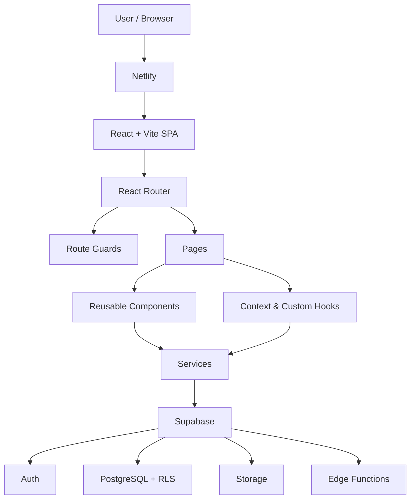

# Cane Corso Heritage

**ReactJS · September 2026**  
**Stefan Tananov**

Cane Corso Heritage is a React single-page application for preserving and sharing Cane Corso history, working tradition, heritage articles and community stories.

It is currently developed as a standalone application and is planned to become a dedicated section of the broader **USG Cane Corso Platform**, which is under active development at **https://usg-cane-corso-platform.com/**.

The project combines public educational content with authenticated community features, member profiles, media sharing, ratings, comments and administration. Supabase provides authentication, PostgreSQL data, Storage and Row Level Security.

## Main features

### Public experience

- Home, Heritage, Stories, Members, About USG and Help pages
- Heritage catalog with dynamic article details
- Community Stories catalog with dynamic Story details
- Public member catalog and member profile pages
- Public approved community files and media
- Ratings for Stories, Heritage articles and supported community files
- Public comments and comment reactions
- English, Bulgarian and Italian interface/content localization

### Authentication and member area

- Register, Login and Logout with persistent Supabase sessions
- Password recovery and password update flow
- Guest, authenticated, completed-profile and admin route guards
- Required profile completion before private member workspaces
- Personal profile editing, avatar and contact visibility controls
- `My Stories` workspace with Create, Read, Update and Delete operations
- `My Files` workspace for private and community files
- Story attachments stored through Supabase Storage
- Controlled forms, validation, loading, retry and error states

### Community interaction

- Story, Heritage and file ratings
- Comments on supported content
- Like / dislike reactions on comments
- Ownership-aware edit and delete actions
- Community visibility and moderation states

### Administration

- Admin-only route and moderation dashboard
- Story and file moderation queues
- Approve / decline moderation actions
- Member account status management
- Admin access to member details and protected moderation operations

## Architecture

The application uses a small layered React architecture. Route pages compose reusable components, Context and custom Hooks manage shared/reusable state, Services isolate backend access, and Supabase provides the remote platform and security layer.



**Primary data flow:** `Page / Component → Hook or Service → Supabase → React state → UI`

- `src/pages` — route-level screens
- `src/components` — reusable UI and feature components
- `src/layouts` — shared application layouts
- `src/routing` — guest/authenticated/profile/admin route guards
- `src/context` — authentication and language providers
- `src/hooks` — reusable React hooks
- `src/services` — Supabase data-access and mutation layer
- `src/lib` — Supabase client setup
- `src/i18n` — global interface translations
- `content-source` — source content used to prepare Heritage material
- `docs` — architecture, localization and security evidence

## Main routes

| Route | Access | Purpose |
| --- | --- | --- |
| `/` | Public | Home |
| `/stories` | Public | Community Stories catalog |
| `/stories/:storyId` | Public / owner-aware | Story details |
| `/heritage` | Public | Heritage library |
| `/heritage/:slug` | Public | Heritage article details |
| `/users` | Public | Members catalog |
| `/users/:userId` | Public | Member profile |
| `/about` | Public | About USG |
| `/help/:topic?` | Public | Help topics |
| `/login` | Guest | Login |
| `/register` | Guest | Registration |
| `/forgot-password` | Public | Password recovery |
| `/update-password` | Recovery session | Set new password |
| `/my-stories` | Authenticated + complete profile | Personal Story workspace |
| `/my-files` | Authenticated + complete profile | Personal file workspace |
| `/admin` | Admin | Moderation and administration |

## Live deployment

The production version of the project is deployed and publicly accessible at:

https://cane-corso-heritage.netlify.app

The deployed frontend is built from the `master` branch using `npm run build` and publishes the Vite `dist` output.

Supabase provides authentication, database, storage, RLS-protected data access and server-side project services.

## Functional Guide

### 1. Project Overview

**Application name:** Cane Corso Heritage  
**Author:** Stefan Tananov  
**Category / topic:** Heritage and community content platform  

Cane Corso Heritage is a React single-page application for preserving and sharing Cane Corso history, working tradition, heritage articles and community stories. Guests can explore public educational and community content, while authenticated members can create and manage their own Stories and files and interact with public content. Supabase provides the hosted backend, authentication, PostgreSQL database, Storage and Row Level Security.

### 2. User Access & Permissions

#### Guest (not authenticated)

Guests can access the public parts of the application, including:

- Home (`/`)
- Stories catalog (`/stories`)
- Story details (`/stories/:storyId`)
- Heritage catalog (`/heritage`)
- Heritage article details (`/heritage/:slug`)
- Gallery (`/gallery`)
- Documents (`/documents`)
- Members catalog (`/users`)
- Public member profiles (`/users/:userId`)
- About USG (`/about`)
- Help (`/help/:topic?`)
- Login, registration and password-recovery pages

Guests can read public approved content, but authenticated actions and private workspaces are protected.

#### Authenticated user

A signed-in user can access all public pages and, after completing the required profile, can also use:

- **My Stories** (`/my-stories`) — create, read, edit and delete owned Stories
- **My Files** (`/my-files`) — upload and manage personal/community files
- Profile editing and account-related functionality
- Ratings on supported public content
- Comments and comment reactions

Ownership is enforced for author-only operations. A regular authenticated user cannot access the admin route.

#### Administrator

An administrator can access the protected `/admin` route and use the moderation and account-management tools, including Story/file moderation queues and member account-status actions.

### 3. Authentication & Session Handling

#### Authentication flow

1. When the application loads, `AuthProvider` asks Supabase Auth for the current session with `getSession()`.
2. The current session, user, role and account status are shared through React Context.
3. `onAuthStateChange()` listens for sign-in, sign-out, initial-session and password-recovery events.
4. Registration uses Supabase Auth `signUp()` after client-side validation and a username availability check.
5. Login uses `signInWithPassword()`.
6. Logout uses `signOut()`.
7. Password recovery uses `resetPasswordForEmail()`, and the new password is saved with `updateUser()`.

#### Session persistence

Supabase persists the authentication session. After a page refresh, the application restores it through `getSession()`. Authentication state is exposed to the application through `AuthContext`, so protected UI and routes respond consistently to the current user.

### 4. Routing Structure

Routing is implemented with React Router and a shared `AppLayout`.

#### Route guard logic

- `RequireGuest` protects guest-only pages such as Login and Register from authenticated users.
- `RequireAuth` prevents unauthenticated users from entering private member pages.
- `RequireCompleteProfile` requires the signed-in member to complete the mandatory profile data before using private workspaces.
- `RequireAdmin` protects the administration area.

#### Main routes

The application contains more than five client-side routes and several dynamic routes. Parameterized routes include:

- `/stories/:storyId`
- `/heritage/:slug`
- `/users/:userId`
- `/help/:topic?`

Nested routing is used for Stories, Heritage and Users under the common application layout.

### 5. List → Details Flow

#### Catalog / list pages

The application contains multiple list-to-details flows:

- **Stories**: `/stories` → `/stories/:storyId`
- **Heritage**: `/heritage` → `/heritage/:slug`
- **Members**: `/users` → `/users/:userId`

Catalog pages load remote records from Supabase-backed services and render lists/cards. Navigation to a specific record is handled by React Router links/navigation and the record identifier becomes part of the URL.

#### Details pages

The Details page reads the route parameter and loads the corresponding remote record. Story and Heritage details also support eligible interactions such as ratings and comments. Missing or unavailable records are handled with UI states instead of crashing the application.

### 6. Data Source & Backend

The project uses **Supabase** as a hosted Backend-as-a-Service.

Supabase provides:

- PostgreSQL database
- Authentication and persistent sessions
- Row Level Security (RLS)
- Storage for Story attachments and user files
- Edge Functions used by translation-related features
- Remote API/SDK communication for application data

Application data is not implemented as a local hardcoded replacement for the backend. The service layer in `src/services` isolates remote data access from the UI components.

### 7. Data Operations (CRUD)

The main evaluated CRUD collection is **Stories**.

#### Create

An authenticated member opens the Story form from **My Stories**, enters the Story data and submits the controlled React form. The service layer creates the new Story in Supabase and can also upload selected attachments.

#### Read

Stories are fetched remotely for the public catalog, Story Details and the current user's **My Stories** workspace.

#### Update

The owner can open an existing Story in edit mode. The same controlled Story form is populated with the existing values and sends the updated data to Supabase. The UI refreshes after a successful save.

#### Delete

The Story owner can delete an owned Story. The application updates the UI after the backend confirms the deletion. Ownership is enforced in the application and by the Supabase security model.

### 8. Forms & Validation

#### Forms used

The application includes controlled React forms for:

- Login
- Registration
- Forgot password
- Update password
- Profile editing/completion
- Story create/edit
- File upload
- Comments

The forms use React state, `onChange`, `onSubmit`, `onClick` and `event.preventDefault()` synthetic-event handling.

#### Example validation rules

- **Email** — required; the field uses an email input and the value is normalized before authentication requests.
- **Password** — required and must contain at least 6 characters in the Login/Register flow.
- **Display name** — registration requires at least 2 characters.
- **Username** — must match the application's allowed username pattern and must not already be in use.
- **Story title, description and content** — required before a Story can be saved.

Validation, submitting states and backend/network errors are surfaced in the UI instead of allowing invalid input to crash the application.

### 9. React-Specific Techniques

#### Hooks & component lifecycle

The project uses React Hooks throughout the application, including:

- `useState` for local UI/form/data state
- `useEffect` for lifecycle and asynchronous state synchronization
- `useMemo` where shared/context values benefit from memoization
- `useRef` for request/submission coordination and stable mutable references
- custom Hooks such as `useAuth`, `useStoryDetails` and `useStoryTranslation`

A lifecycle example is `AuthProvider`: on mount it restores the Supabase session and subscribes to authentication changes; while mounted it updates shared authentication state; on unmount its cleanup unsubscribes from the Supabase authentication listener.

#### Context API

Two important shared state areas use Context:

- **Auth Context** — session, current user, role, account status and authentication actions
- **Language Context** — selected interface language and language switching

These values are consumed by route guards, pages and reusable components.

#### Component styling

The UI uses external CSS and CSS Modules. Styling is separated from React logic and organized next to application/component concerns.

### 10. Typical User Flow

1. A visitor opens the deployed application and browses Stories, Heritage, Members or other public content.
2. The visitor registers or logs in through Supabase Auth.
3. After completing the required profile, the member opens **My Stories** and creates a new Story.
4. The Story can later be viewed, edited or deleted by its owner, while eligible public content can receive ratings, comments and reactions from authenticated members.

An administrator can instead enter the protected administration area to review moderation queues and member/account actions.

### 11. Error & Edge Case Handling

The application handles common failure states explicitly:

- **Authentication errors** — invalid credentials, unconfirmed email, duplicate username, connection problems and unresolved account state are shown to the user.
- **Network/data errors** — asynchronous operations use error states and guarded service calls; loading/submitting states prevent confusing duplicate actions.
- **Empty or missing data** — catalogs/details render dedicated empty, unavailable or not-found states where appropriate.
- **Authorization edge cases** — route guards prevent access to private/admin pages, while Supabase RLS independently protects backend data.
- **Async lifecycle/race cases** — relevant flows use cleanup, request coordination or abort/stale-request protection so obsolete responses do not overwrite newer UI state.

## Demo accounts for evaluation

Two dedicated demo accounts are available so evaluators can inspect the authenticated and administrative parts of the application without creating new accounts.

### How to enter the application

1. Start the application with `npm run dev`.
2. Open the URL printed by Vite in the terminal, normally `http://localhost:5173/`.
3. Select **Login** from the application header, or open `/login` directly.
4. Sign in with one of the demo accounts below.
5. Use **Logout** before switching between the regular-user and admin accounts.

### Regular user demo

- **Email:** `softuniuser@test.com`
- **Password:** `user123`

Recommended evaluation flow:

- Open `/my-stories` to test authenticated Story CRUD operations.
- Open `/my-files` to inspect the personal file workspace and uploads.
- Open public Story, Heritage or supported file content to test ratings, comments and reactions.
- Open the member/profile area to inspect authenticated profile functionality.

### Admin demo

- **Email:** `SoftUniAdmin@test.com`
- **Password:** `admin123`

Recommended evaluation flow:

- Open `/admin` after login.
- Inspect the protected administration dashboard.
- Review Story and file moderation queues.
- Test moderation actions and member/account-status management.
- Confirm that admin-only routes are unavailable to the regular-user account.

> These accounts are dedicated to project evaluation and contain no personal or sensitive data.
> Please keep the supplied credentials unchanged so the accounts remain available for evaluation.

## Authentication and authorization

Authentication is provided by Supabase Auth. The application restores the current session on load and listens for authentication-state changes through the shared Auth Context.

React route guards control navigation and user experience, but backend authorization is enforced by Supabase Row Level Security (RLS).

RLS was verified directly against the connected Supabase database on **2026-10-07**. All 15 application tables in the `public` schema reported `rowsecurity = true`, and the active policies were inspected through `pg_policies`.

Detailed evidence and the read-only verification SQL are documented in [`docs/security-rls.md`](docs/security-rls.md).

## Supabase usage

Supabase is used for:

- Authentication and persistent sessions
- PostgreSQL application data
- Row Level Security and ownership rules
- Story, profile, comment, reaction, rating and moderation data
- File and Story-attachment Storage
- Remote/server-side operations used by the application

Local configuration is supplied through `.env.local`:

```env
VITE_SUPABASE_URL=your-project-url
VITE_SUPABASE_PUBLISHABLE_KEY=your-publishable-key
```

`.env.local` is ignored by Git and is not committed.

## Run locally

Requirements: a current Node.js/npm installation and valid Supabase environment values.

```bash
npm install
npm run dev
```

Production and quality checks:

```bash
npm run verify
npm run lint
npm run build
```

Optional local production preview:

```bash
npm run preview
```

## Technology stack

- React 19
- React Router
- Vite
- Supabase JavaScript client
- Supabase Auth
- PostgreSQL + Row Level Security
- Supabase Storage
- CSS / CSS Modules
- ESLint

## Project documentation

Detailed technical evidence is kept outside the main README so this page remains concise:

- [`docs/security-rls.md`](docs/security-rls.md) — deployed RLS verification
- [`docs/content-localization.md`](docs/content-localization.md) — content localization architecture
- [`docs/story-translation.md`](docs/story-translation.md) — Story translation setup

## Repository

https://github.com/SATananov/CaneCorsoHeritage
