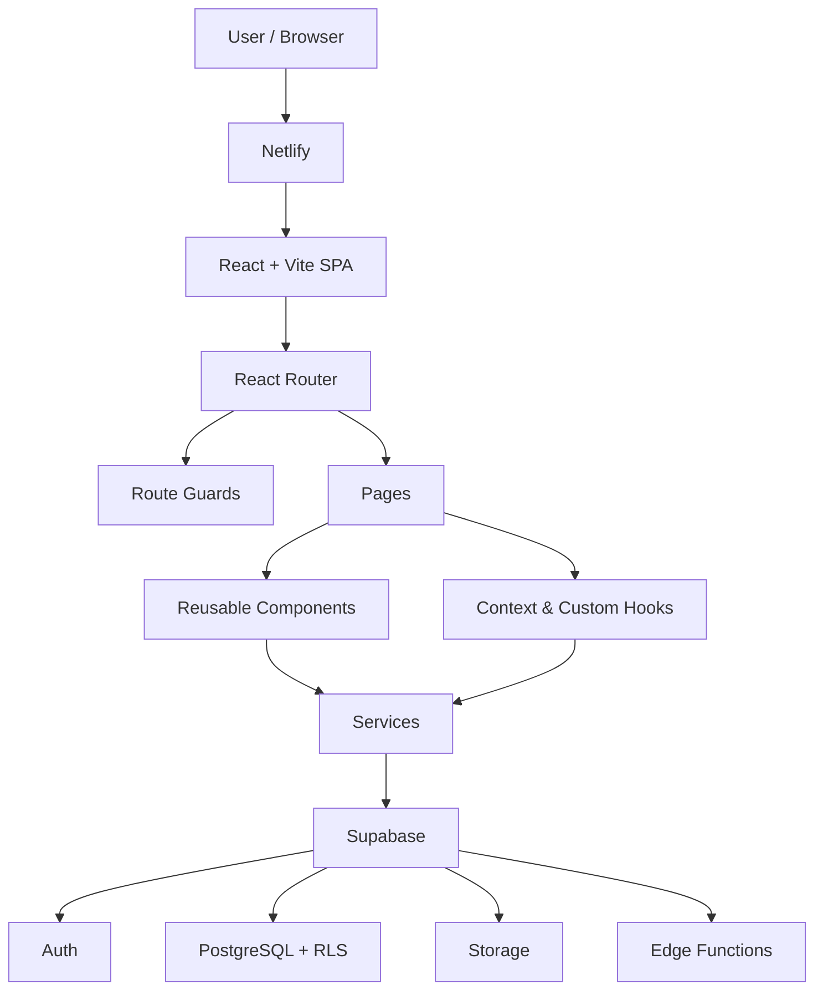

# Cane Corso Heritage

**ReactJS · September 2026**  
**Stefan Tananov**

Cane Corso Heritage is a React single-page application for preserving and sharing Cane Corso history, working tradition, heritage articles and community stories.

It is currently developed as a standalone application and is planned to become a dedicated section of the broader **USG Cane Corso Platform**, which is under active development at **https://usg-cane-corso-platform.com/**.

The project combines public educational content with authenticated community features, member profiles, media sharing, ratings, comments and administration. Supabase provides authentication, PostgreSQL data, Storage and Row Level Security.

## Main features

### Public experience

- Home, Heritage, Stories, Members, About USG and Help pages
- Heritage catalog with dynamic article details
- Community Stories catalog with dynamic Story details
- Public member catalog and member profile pages
- Public approved community files and media
- Ratings for Stories, Heritage articles and supported community files
- Public comments and comment reactions
- English, Bulgarian and Italian interface/content localization

### Authentication and member area

- Register, Login and Logout with persistent Supabase sessions
- Password recovery and password update flow
- Guest, authenticated, completed-profile and admin route guards
- Required profile completion before private member workspaces
- Personal profile editing, avatar and contact visibility controls
- `My Stories` workspace with Create, Read, Update and Delete operations
- `My Files` workspace for private and community files
- Story attachments stored through Supabase Storage
- Controlled forms, validation, loading, retry and error states

### Community interaction

- Story, Heritage and file ratings
- Comments on supported content
- Like / dislike reactions on comments
- Ownership-aware edit and delete actions
- Community visibility and moderation states

### Administration

- Admin-only route and moderation dashboard
- Story and file moderation queues
- Approve / decline moderation actions
- Member account status management
- Admin access to member details and protected moderation operations

## Architecture

The application uses a small layered React architecture. Route pages compose reusable components, Context and custom Hooks manage shared/reusable state, Services isolate backend access, and Supabase provides the remote platform and security layer.



**Primary data flow:** `Page / Component → Hook or Service → Supabase → React state → UI`

- `src/pages` — route-level screens
- `src/components` — reusable UI and feature components
- `src/layouts` — shared application layouts
- `src/routing` — guest/authenticated/profile/admin route guards
- `src/context` — authentication and language providers
- `src/hooks` — reusable React hooks
- `src/services` — Supabase data-access and mutation layer
- `src/lib` — Supabase client setup
- `src/i18n` — global interface translations
- `content-source` — source content used to prepare Heritage material
- `docs` — architecture, localization and security evidence

## Main routes

| Route | Access | Purpose |
| --- | --- | --- |
| `/` | Public | Home |
| `/stories` | Public | Community Stories catalog |
| `/stories/:storyId` | Public / owner-aware | Story details |
| `/heritage` | Public | Heritage library |
| `/heritage/:slug` | Public | Heritage article details |
| `/users` | Public | Members catalog |
| `/users/:userId` | Public | Member profile |
| `/about` | Public | About USG |
| `/help/:topic?` | Public | Help topics |
| `/login` | Guest | Login |
| `/register` | Guest | Registration |
| `/forgot-password` | Public | Password recovery |
| `/update-password` | Recovery session | Set new password |
| `/my-stories` | Authenticated + complete profile | Personal Story workspace |
| `/my-files` | Authenticated + complete profile | Personal file workspace |
| `/admin` | Admin | Moderation and administration |

## Live deployment

The production version of the project is deployed and publicly accessible at:

https://cane-corso-heritage.netlify.app

The deployed frontend is built from the `master` branch using `npm run build` and publishes the Vite `dist` output.

Supabase provides authentication, database, storage, RLS-protected data access and server-side project services.

## Functional guide

1. A guest can browse Heritage, Stories, Members and other public pages.
2. A visitor can register or log in through Supabase Auth.
3. An authenticated member completes the required profile before entering private workspaces.
4. In **My Stories**, the member can create, edit and delete owned Stories and manage Story visibility/attachments.
5. In **My Files**, the member can upload files, keep them private or share supported content with the Community.
6. Logged-in members can interact with eligible public content through ratings, comments and comment reactions.
7. Public community content is shown according to visibility and moderation state.
8. Admin users can access the protected moderation dashboard and manage moderation/account actions.

## Demo accounts for evaluation

Two dedicated demo accounts are available so evaluators can inspect the authenticated and administrative parts of the application without creating new accounts.

### How to enter the application

1. Start the application with `npm run dev`.
2. Open the URL printed by Vite in the terminal, normally `http://localhost:5173/`.
3. Select **Login** from the application header, or open `/login` directly.
4. Sign in with one of the demo accounts below.
5. Use **Logout** before switching between the regular-user and admin accounts.

### Regular user demo

- **Email:** `softuniuser@test.com`
- **Password:** `user123`

Recommended evaluation flow:

- Open `/my-stories` to test authenticated Story CRUD operations.
- Open `/my-files` to inspect the personal file workspace and uploads.
- Open public Story, Heritage or supported file content to test ratings, comments and reactions.
- Open the member/profile area to inspect authenticated profile functionality.

### Admin demo

- **Email:** `SoftUniAdmin@test.com`
- **Password:** `admin123`

Recommended evaluation flow:

- Open `/admin` after login.
- Inspect the protected administration dashboard.
- Review Story and file moderation queues.
- Test moderation actions and member/account-status management.
- Confirm that admin-only routes are unavailable to the regular-user account.

> These accounts are dedicated to project evaluation and contain no personal or sensitive data.
> Please keep the supplied credentials unchanged so the accounts remain available for evaluation.

## Authentication and authorization

Authentication is provided by Supabase Auth. The application restores the current session on load and listens for authentication-state changes through the shared Auth Context.

React route guards control navigation and user experience, but backend authorization is enforced by Supabase Row Level Security (RLS).

RLS was verified directly against the connected Supabase database on **2026-10-07**. All 15 application tables in the `public` schema reported `rowsecurity = true`, and the active policies were inspected through `pg_policies`.

Detailed evidence and the read-only verification SQL are documented in [`docs/security-rls.md`](docs/security-rls.md).

## Supabase usage

Supabase is used for:

- Authentication and persistent sessions
- PostgreSQL application data
- Row Level Security and ownership rules
- Story, profile, comment, reaction, rating and moderation data
- File and Story-attachment Storage
- Remote/server-side operations used by the application

Local configuration is supplied through `.env.local`:

```env
VITE_SUPABASE_URL=your-project-url
VITE_SUPABASE_PUBLISHABLE_KEY=your-publishable-key
```

`.env.local` is ignored by Git and is not committed.

## Run locally

Requirements: a current Node.js/npm installation and valid Supabase environment values.

```bash
npm install
npm run dev
```

Production and quality checks:

```bash
npm run verify
npm run lint
npm run build
```

Optional local production preview:

```bash
npm run preview
```

## Technology stack

- React 19
- React Router
- Vite
- Supabase JavaScript client
- Supabase Auth
- PostgreSQL + Row Level Security
- Supabase Storage
- CSS / CSS Modules
- ESLint

## Project documentation

Detailed technical evidence is kept outside the main README so this page remains concise:

- [`docs/security-rls.md`](docs/security-rls.md) — deployed RLS verification
- [`docs/content-localization.md`](docs/content-localization.md) — content localization architecture
- [`docs/story-translation.md`](docs/story-translation.md) — Story translation setup

## Repository

https://github.com/SATananov/CaneCorsoHeritage
